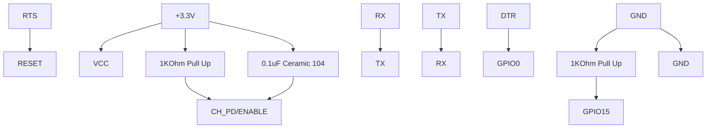

# Core ESP8266 On Windows

### This Is A Simple Guide For Setting Up Esp8266 Tool-Chain,  Programming Interface And Hardware On Windows In A Easy Manner       

## Hardware Steps 

### I am using A USB-To-UART (At +3.3V Not 5V) Converter With ESP-07 But Any ESP Module Will Work If It has The Following Pins Available

               USB-To-UART                          ESP Module
                   RTS -------------------------------RESET
                   +3.3V|------1KOhm Pull Up----|CH_PD/ENABLE
                        |-------0.1uF(104)------| 
                   +3.3V------------------------------VCC
                   RX---------------------------------TX
                   TX---------------------------------RX
                   DTR--------------------------------GPIO0
                   GND-------- 1KOhm Pull Down--------GPIO15
                   GND--------------------------------GND
                   
<html>
  

  <body>

  
</body>
</html>

## Software Steps 

- Download The MSYS2 Zip
https://dl.espressif.com/dl/esp32_win32_msys2_environment_and_toolchain-20181001.zip
- Download The Tool-Chain
https://dl.espressif.com/dl/xtensa-lx106-elf-gcc8_4_0-esp-2020r3-win32.zip
- Extract MSYS2 To Any Location, I prefer `C:\`
**From Now On I Will Refer To Locations w.r.t  C:\\**
- Extract Tool-Chain In
 `C:\msys32\opt`
- Open a MSYS2 MINGW32 Terminal Window From
`C:\msys32\mingw32.exe`
- Run The Following Commands In MINGW32 Terminal
`mkdir -p ~/esp`
`cd ~/esp`
`git clone --recursive https://github.com/espressif/ESP8266_RTOS_SDK.git`
- Setup Path Variable For ESP8266_RTOS_SDK With Name 
`IDF_PATH`
- Run The Following Commands In MINGW32 Terminal
`python -m pip install --user -r $IDF_PATH/requirements.txt`
`cp -r $IDF_PATH/examples/get-started/hello_world .`
`cd ~/esp/hello_world`
- Connect Your Development Board And Note Its Serial Port Number 
- Run The Following Commands In MINGW32 Terminal
`make menuconfig`
- A Menu Will Popup 
- In The Menu, 
  - Use Up & Down Keys To Navigate The Menu
  - Use Enter key To Go Into A Sub-Menu, Escape Key To Back
  - Now, Navigate To `Serial flasher config` > `Default serial port` 
     To Configure The Serial Port Confirm selection by pressing enter, save     configuration by selecting `< Save >`
   
  - Navigate back To Main Menu And Move To `SDK Tool Config` Press   Enter
  - Enter Full Path To Your Tool-Chain In This Fashion **PAY ATTENTION HERE**
       
  - Save The Configuration by selecting `< Save >` and then exit application by selecting `< Exit >`
-Connect Your Hardware And Run The Following Command In Terminal 
`make flash` 
Have Patience, It Will Take Some Time. It Will Compile And Upload Your File

## _Enjoy_
